# METHODOLOGIES.md
## Metodologías de desarrollo de software — SDR como sensor/herramienta + AI-assisted con HITL

> **Hallazgo estructural:** no existe (aún) una metodología única que ocupe exactamente la
> intersección "software de aplicación con SDR-sensor + desarrollo AI-assisted con HITL". Lo que
> hay es: **(A)** metodologías AI-assisted-con-HITL maduras pero agnósticas de dominio,
> **(B)** prácticas y estándares de ingeniería de software para SDR-sensor, y **(C)** un conjunto
> reciente (2025–2026) que une agentes LLM con desarrollo de software SDR. El camino práctico es
> **componer A + B**, con C como evidencia temprana. **(D)** aporta el respaldo normativo del HITL.

Cada entrada trae: descripción breve, referencia trazable y un diagrama de flujo de cómo funciona.

---

# Bloque A — AI-assisted con HITL (maduras, agnósticas de dominio)

## A1 · Spec-Driven Development (SDD)

La spec ejecutable y versionada —no el código— es la única fuente de verdad; el código es un
output regenerable. El HITL vive en la fase de revisión, donde humano y agente confirman que la
implementación coincide con la spec. Surge como respuesta al "vibe coding".

**Trazabilidad (industrial):** GitHub Spec Kit (open-source MIT, model-agnostic, sept 2025) ·
AWS Kiro (GA nov 2025, notación EARS) · BMAD-METHOD (43K+ ⭐, agentes "Agent-as-Code") · OpenSpec · Tessl.
- https://github.com/github/spec-kit
- https://kiro.dev
- https://github.com/bmad-code-org/BMAD-METHOD

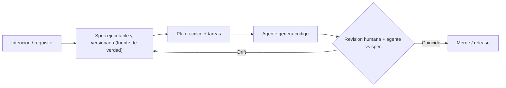

---

## A2 · HULA — Human-in-the-loop LLM-based Agents (Atlassian)

Framework de tres agentes (Planner, Coding, Human) donde el ingeniero guía y refina al LLM en
planificación y código, reteniendo control total para revisar en cada paso. Diseñado, implementado
y desplegado en Atlassian JIRA (conecta con RovoDev).

**Trazabilidad (académica + industrial):** ICSE 2025 – SEIP (IEEE/ACM); Atlassian + Monash +
University of Melbourne; desplegado en producción interna.
- https://arxiv.org/abs/2411.12924

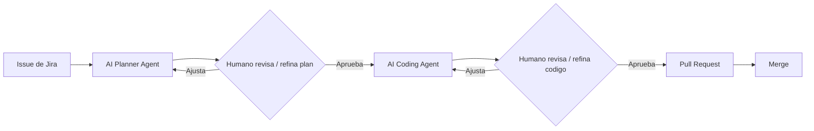

---

## A3 · Agentic SDLC (A-SDLC)

Formaliza el ciclo agéntico: arquitectura de referencia de seis capas y contraste entre el SDLC
tradicional y uno agéntico. Evidencia empírica: SWE-bench Verified de 1.96% a 78.4% (oct 2023 –
abr 2026); ahorros de tiempo 13.6%–55.8%.

**Trazabilidad (académica):** arXiv 2604.26275 (Bhati, 2026).
- https://arxiv.org/abs/2604.26275

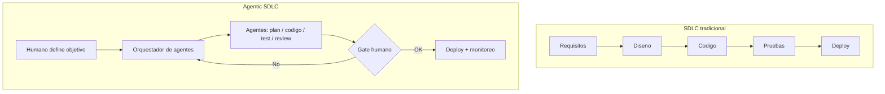

---

## A4 · Evaluation-Driven Development (EDD) / Agent Development Lifecycle (ADLC)

La evaluación no es una fase puntual sino un lazo continuo a nivel de sistema (contexto,
planificación, memoria, guardrails). La observabilidad (traces) habilita la evaluación; el loop de
mejora empieza con un trace.

**Trazabilidad:** EDD — arXiv 2411.13768 (académico) · ADLC — IBM y LangChain (industrial) ·
AI-SDLC — FHNW, arXiv 2609.24348.
- https://arxiv.org/pdf/2411.13768
- https://www.ibm.com/think/topics/agent-development-lifecycle-adlc
- https://www.langchain.com/blog/the-agent-development-lifecycle

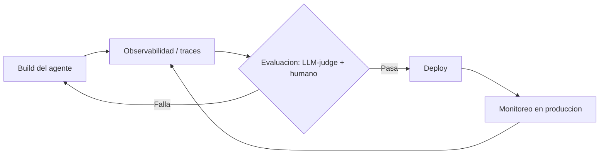

---

# Bloque B — SDR como sensor/herramienta: software y estándares

## B1 · NTIA/ITS SCOS (scos-sensor)

Implementación de referencia del estándar **IEEE 802.15.22.3** (Spectrum Characterization and
Occupancy Sensing) por NTIA/ITS. API REST para operar un SDR como sensor sobre red; arquitectura de
plugins por hardware; QA vía testing automatizado antes de cada release; metadatos SigMF.

**Trazabilidad (gubernamental / open source):**
- https://github.com/NTIA/scos-sensor
- https://github.com/NTIA/scos-actions
- https://github.com/NTIA/scos-usrp

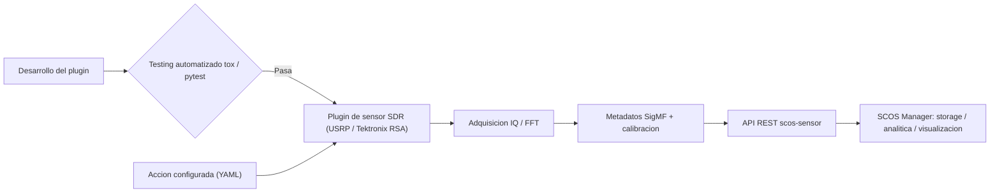

---

## B2 · SigMF — Signal Metadata Format

Estándar de facto para procedencia y reproducibilidad de datos IQ. Un *recording* = archivo de
datos + sidecar JSON de metadatos; evita el "bitrot" y habilita portabilidad entre herramientas.
Originado en un esfuerzo patrocinado por DARPA.

**Trazabilidad (estándar comunitario):** adoptado por GNU Radio, Inspectrum, IQEngine, DeepSig,
NTIA/SCOS y pipelines ML.
- https://github.com/sigmf/SigMF
- https://sigmf.org

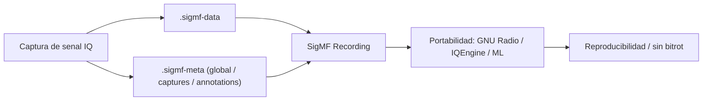

---

## B3 · GNU Radio / GR4 + ciclo de vida de pipeline de datos

GNU Radio es el framework base para software SDR-sensor; GR4 apunta a ser el estándar de workflows
de procesamiento reproducibles y AI-enabled. El andamiaje de ciclo de vida lo aporta la ingeniería
de pipelines: prototipar → verificar semántica → release (Google SRE), con conmutación
simulación↔real.

**Trazabilidad:**
- https://www.gnuradio.org/news/2025-12-17-gr4-transform-sdr-workflows/
- https://sre.google/workbook/data-processing/
- Labs RFML: https://github.com/Dollarhyde/radio-frequency-machine-learning

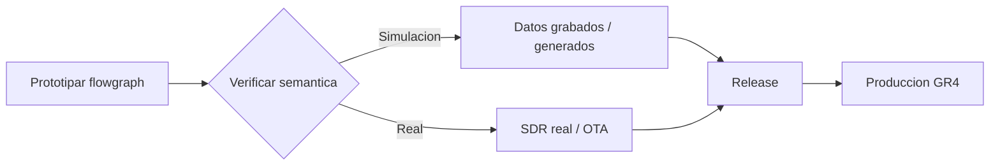

---

# Bloque C — Intersección (AI-assisted + software SDR) — emergente

## C1 · GR-MCP / GNU Radio MCP Server

Servidor MCP que expone la librería de bloques, gestión de flowgraphs y generación de código a
clientes LLM, con **validación de tipos y conexiones** antes de generar código. Resuelve que los
LLMs sin tooling de dominio producen flowgraphs plausibles pero no funcionales.

**Trazabilidad:** https://github.com/Dollarhyde/gr-mcp

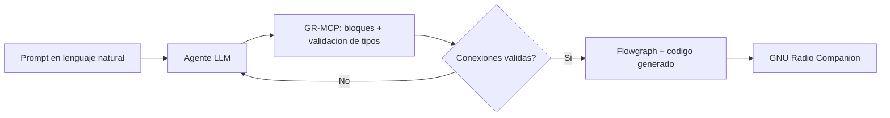

---

## C2 · gr-playground — agent skills + AGENTS.md para SDR

Skills de agente preempaquetadas (`analyze-rf-signal`, `rtlsdr-hardware-capture`,
`build-gnuradio-flowgraph`) + `AGENTS.md`, invocables en lenguaje natural, con salida SigMF y
revisión humana en el lazo.

**Trazabilidad:** https://github.com/nitrojacob/gr-playground

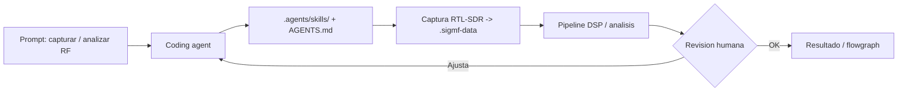

---

## C3 · RadioMaster / RadioBench — multi-agente + benchmark

Sistema multi-agente que trata la generación de señales como cadena acoplada (planificación de
protocolo → síntesis de banda base → configuración de hardware) con RAG sobre repos SDR, evaluado
con RadioBench. Evidencia de que los modelos genéricos fallan sin agentes de dominio → justifica
los gates humanos.

**Trazabilidad (académica):** arXiv 2606.01862 (2026).
- https://arxiv.org/abs/2606.01862

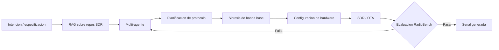

---

# Bloque D — Normativa que ancla el HITL

- **EU AI Act, Art. 14:** supervisión humana obligatoria para alto riesgo; tres patrones (HITL /
  HOTL / control en tiempo real); 14(4) exige cinco capacidades (entender, sesgo de automatización,
  interpretar, anular, detener). https://www.euaiact.com/blog/eu-ai-act-human-oversight
- **ISO/IEC 42001:2023 (AIMS):** requisitos de revisión humana de outputs.
- **NIST AI RMF (GOVERN):** roles humanos en decisiones de riesgo de IA.

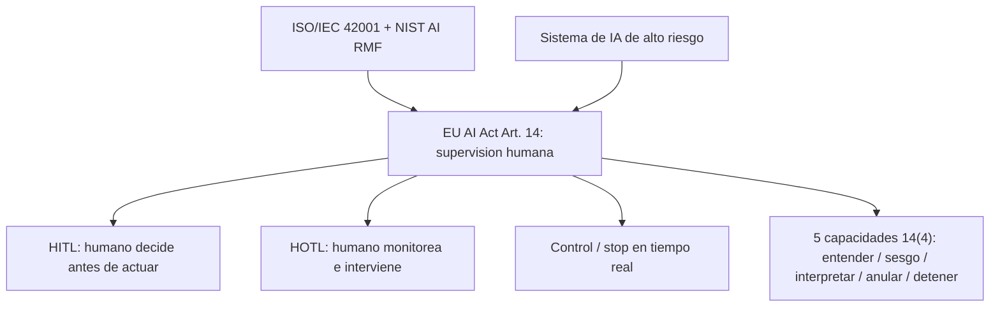

---

# Mapeo metodología → dimensiones (de DIMENSION_ANALYSIS.md)

| Metodología | Dimensiones que cubre mejor |
|---|---|
| A1 SDD | D3 (fuente de verdad), D1 (regenerable), D10 (generación), D4 |
| A2 HULA | D2 (HITL), D4 (eval offline+online), D3 |
| A3 A-SDLC | D4, D2, D7 (modularidad de agentes), D13 |
| A4 EDD / ADLC | D4 (eval continua), D6 (observabilidad) |
| B1 SCOS | D5 (recursos/tiempo real), D9 (procedencia), D10, D12 |
| B2 SigMF | D1 (reproducibilidad), D9 (procedencia), D8 (record/replay) |
| B3 GNU Radio / GR4 | D5, D8 (sim-to-real), D7 |
| C1 GR-MCP | D3+D10 (generación validada), D7 |
| C2 gr-playground | D2 (HITL), D7 (skills), D9 (SigMF) |
| C3 RadioMaster | D4 (benchmark), D7 (multi-agente), D8 |
| D Normativa | D12 (gobernanza/cumplimiento), D2 |

---

# Referencias (índice trazable)

| # | Fuente | Tipo | Señal de trazabilidad | Link |
|---|--------|------|-----------------------|------|
| 1 | GitHub Spec Kit | Industrial / OSS | MIT, ruta de referencia de Microsoft/Copilot | https://github.com/github/spec-kit |
| 2 | AWS Kiro | Industrial | GA nov 2025, producto AWS | https://kiro.dev |
| 3 | BMAD-METHOD | Industrial / OSS | 43K+ ⭐, v6 estable | https://github.com/bmad-code-org/BMAD-METHOD |
| 4 | HULA | Académico + industrial | ICSE-SEIP 2025 (IEEE/ACM), desplegado en Atlassian | https://arxiv.org/abs/2411.12924 |
| 5 | Agentic SDLC (A-SDLC) | Académico | arXiv 2604.26275 | https://arxiv.org/abs/2604.26275 |
| 6 | Evaluation-Driven Development | Académico | arXiv 2411.13768 | https://arxiv.org/pdf/2411.13768 |
| 7 | ADLC (IBM) | Industrial | Documentación IBM | https://www.ibm.com/think/topics/agent-development-lifecycle-adlc |
| 8 | ADLC (LangChain) | Industrial | Blog LangChain | https://www.langchain.com/blog/the-agent-development-lifecycle |
| 9 | AI-SDLC (FHNW) | Académico | arXiv 2609.24348 | https://arxiv.org/pdf/2609.24348 |
| 10 | SCOS Sensor | Gubernamental / OSS | NTIA/ITS, IEEE 802.15.22.3 | https://github.com/NTIA/scos-sensor |
| 11 | SCOS Actions | Gubernamental / OSS | Interfaces + calibración | https://github.com/NTIA/scos-actions |
| 12 | SigMF | Estándar comunitario | DARPA-origin, adopción amplia | https://github.com/sigmf/SigMF |
| 13 | GNU Radio GR4 | Industrial / OSS | Anuncio oficial GR4 | https://www.gnuradio.org/news/2025-12-17-gr4-transform-sdr-workflows/ |
| 14 | Google SRE (pipelines) | Industrial | SRE Workbook | https://sre.google/workbook/data-processing/ |
| 15 | RFML Labs | Educativo / OSS | Repo con GNU Radio + PyTorch | https://github.com/Dollarhyde/radio-frequency-machine-learning |
| 16 | GR-MCP | OSS | Servidor MCP para GNU Radio | https://github.com/Dollarhyde/gr-mcp |
| 17 | gr-playground | OSS | Agent skills + AGENTS.md | https://github.com/nitrojacob/gr-playground |
| 18 | RadioMaster / RadioBench | Académico | arXiv 2606.01862 | https://arxiv.org/abs/2606.01862 |
| 19 | EU AI Act Art. 14 | Normativa | Regulación UE | https://www.euaiact.com/blog/eu-ai-act-human-oversight |

*Documento de síntesis. Enlaces verificados al momento de la investigación; las cifras de adopción
(estrellas, fechas GA) y el panorama de herramientas evolucionan rápido — conviene reconfirmar.*